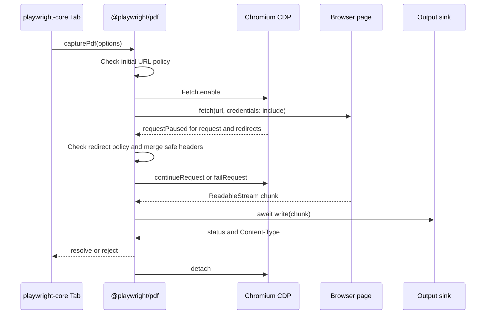

# PDF capture architecture

## Status

Accepted on 2026-07-21.

## Purpose

`@playwright/pdf` is the reusable capture engine for PDF documents that already exist at a URL. It preserves browser session behavior while streaming bytes to an embedder. Playwright's MCP backend uses it to save documents that Chromium opens in its built-in PDF viewer.

The package deliberately does not own browser tabs, navigation history, artifact paths, PDF parsing, or PDF generation. Those concerns either belong to the embedding application or already have an owner in `playwright-core`.

## Component boundary

```mermaid
flowchart LR
  Tool[MCP or CLI tool] --> Response[playwright-core Response]
  Response --> Tab[playwright-core Tab]
  Tab --> Package[@playwright/pdf capturePdf]
  Package --> Page[Playwright Page fetch]
  Package --> CDP[Chromium CDP Fetch domain]
  Package --> Sink[Caller-provided byte sink]
  Tab --> Artifact[Output artifact lifecycle]
```

| Component | Owns |
| --- | --- |
| `playwright-core` `Tab` | PDF navigation detection, history restoration, dedicated-tab behavior, cached artifact path, and MCP event cleanup. |
| `playwright-core` `Context` | Allowed/blocked origin policy, output directory policy, and close-target selection. |
| `playwright-core` `Response` | User-facing snapshot text, relative artifact links, data-URL redaction, and output-budget retention. |
| `@playwright/pdf` | URL helpers, safe filename suggestion, authenticated fetch, redirect checks, header reuse, streaming, timeout, cancellation, and CDP cleanup. |
| Package caller | Output destination, file permissions, retention, and any parsing of the captured bytes. |

This keeps the package interface small: one deep operation, `capturePdf(options)`, plus four deterministic URL helpers.

## Dependency shape

`playwright-core` declares `@playwright/pdf` as a runtime dependency and externalizes it from `coreBundle.js`. The package imports Playwright types only; its emitted JavaScript does not require `playwright-core`. Its peer dependency communicates the compatible public types without creating a JavaScript module cycle.

The repository build compiles `packages/playwright-pdf/src/index.ts` to `lib/index.js`. Root `index.js` and `index.mjs` provide CommonJS and ESM entry points, and `index.d.ts` is the public TypeScript contract. The package tarball includes only those runtime files, documentation, license files, and metadata.

## MCP document lifecycle

### 1. Detect

`Tab` observes main-frame responses. A response becomes a tracked PDF only when its exact media type is `application/pdf` and `Content-Disposition` is not `attachment`. Attachments remain normal browser downloads.

`blob:` and `data:` documents do not emit a reusable network response. Before a snapshot, `Tab` probes `document.contentType` once per URL and classifies those URLs as local.

### 2. Preserve the application tab

When a GET PDF replaces a real application URL, `Tab.ensurePdfInNewTab()` creates a new tab for the PDF and restores the application with browser history. Closing the PDF then selects and foregrounds the original application tab.

The move is intentionally skipped when it cannot be reproduced safely:

- a `blob:` or `data:` URL belongs to its current page;
- a non-GET result could not be recreated by a fresh GET;
- a same-URL replacement consumed the previous history entry;
- restoration fails or the new tab does not load the same PDF.

### 3. Allocate the artifact

`Tab` asks `Context` for an allowed output path. It opens the file with exclusive creation (`wx`) and adds a GUID suffix on a basename collision. A failed or cancelled capture closes and removes the partial file. Successful paths are cached until output-budget cleanup removes them, at which point the next snapshot captures again.

### 4. Capture

`Tab` calls `capturePdf()` with the page, URL, original response, action timeout, cancellation signal, network-policy callback, output writer, and internal-request cleanup hook.

For network URLs, the package performs this sequence:



The page performs the fetch so cookies, service workers, CORS behavior, and Playwright routes are the same browser behavior available to the application. Each `ReadableStream` chunk is base64-encoded only for the page-to-Node binding hop, decoded immediately in Node, and awaited by the output sink. The complete PDF is never buffered by the package.

## Header and credential rules

When an original navigation response is supplied, its request headers are candidates for the capture request. CDP merges reusable headers after Playwright routes have run.

The following headers are never reused because the browser or transport must compute them for the new request:

- `Connection`
- `Content-Length`
- `Host`
- `Range` and `If-Range`
- `Transfer-Encoding`
- every `Proxy-*` header

If the original request had no `Cookie` header, the merged request removes cookies even though page fetch uses `credentials: 'include'`. This prevents capture from silently becoming more privileged than the navigation it reproduces.

A same-origin referrer is supplied through `fetch`. A cross-origin original referrer is restored through CDP, where browser fetch restrictions would otherwise discard it.

## Network policy

The package has no built-in allowlist. An embedder can supply `checkNetworkUrlAllowed(url)`. `playwright-core` supplies its configured allowed/blocked-origin policy.

The callback runs before browser work starts and for every URL observed in the CDP redirect chain. If it throws during a redirect, the package fails that paused request and rethrows the policy error instead of the browser's generic `Failed to fetch` message.

Local `blob:` and `data:` URLs do not cross a network boundary and skip the network-policy callback.

## Cancellation and timeout

An already-aborted signal fails before page or CDP work. During capture, an abort listener calls the page-owned `AbortController`, rejects the operation with the signal reason, and is removed in `finally`.

The timeout follows the same cancellation path. It defaults to 30 seconds, accepts the embedding action timeout, and can be disabled with `0`.

Every exit path disposes the exposed binding, removes the request listener, reports internal requests, clears the timer and abort listener, and detaches CDP. The core caller separately removes a partial output file.

## Validation and failures

| Condition | Result |
| --- | --- |
| Initial or redirected URL is blocked | Policy error is propagated. |
| Signal aborts | Browser fetch is aborted and the signal reason is propagated. |
| Timeout expires | Capture rejects with the configured timeout. |
| HTTP response is not successful | Capture rejects with status and status text. |
| Exact media type is not `application/pdf` | Capture rejects with the received media type. |
| Response has no readable stream | Capture rejects without producing a successful artifact. |
| Output writer rejects | Capture rejects and core deletes the partial file. |
| Original method is not GET | Core reports that the result cannot be re-fetched; the package is not called. |

The package validates HTTP and media-type results in both the browser and Node sides. The Node-side exact media-type check prevents values such as `application/pdfx` from being accepted.

## Browser and CPU support

Network capture is Chromium-only because Playwright exposes `newCDPSession()` only for Chromium. The current MCP PDF viewer flow is therefore tested in Chrome and Chromium; Firefox and WebKit intentionally skip it. Local `blob:` and `data:` fetching does not need CDP, but the URL must still belong to the supplied page.

The package has no native addon and ships no browser binary. arm64 and x64 receive the same JavaScript tarball. CPU-specific browser installation and launch behavior remain the responsibility of `playwright-core`. The repository's package-install E2E runs on the host architecture and supplies the matching Playwright browser executable.

## Verification matrix

| Layer | Evidence |
| --- | --- |
| Unit | Exact PDF media types, safe filename derivation, viewer-fragment normalization, and local URL classification. |
| Package API | Real Chromium page and loopback server stream exact bytes and verify abort plus timeout behavior through `capturePdf()`. |
| MCP E2E | Navigation, links, data/blob URLs, routes, headers, redirects, history, output budget, downloads, and cleanup. |
| Installation E2E | A clean project installs packed `@playwright/pdf` and `playwright-core` tarballs, loads CommonJS and ESM exports, launches Chromium, and compares exact bytes. |
| Static/package gates | Full build, TypeScript, ESLint, dependency boundaries, workspace consistency, and tarball contents. |

## Decision record

### Context

The original implementation placed authenticated PDF streaming inside the MCP `Tab` class. That coupled reusable request logic to tab/history state, made the class substantially larger, and prevented direct package use.

### Decision

Extract the fetch and URL logic into public `@playwright/pdf`. Keep tab/history and artifact ownership in `playwright-core`, and inject the small policies and sinks the package needs.

### Alternatives considered

1. Move the entire `Tab` PDF state machine into the package. Rejected because it would expose MCP-specific tab and context internals and create a broad, shallow API.
2. Use Node `fetch`. Rejected because it would not naturally preserve page cookies, Playwright routes, service workers, CORS behavior, or browser referrer semantics.
3. Buffer `response.arrayBuffer()` in the page. Rejected because large PDFs would be held in both browser and Node memory before writing.
4. Keep helpers in `playwright-core` and publish a wrapper package. Rejected because the package would not own the difficult behavior and could not work independently.

### Consequences

- PDF streaming is independently installable and testable through one public operation.
- `Tab` keeps only the integration adapter and document lifecycle state.
- `playwright-core` gains one small runtime package dependency.
- Network capture remains Chromium-specific until Playwright exposes equivalent interception primitives for other engines.
